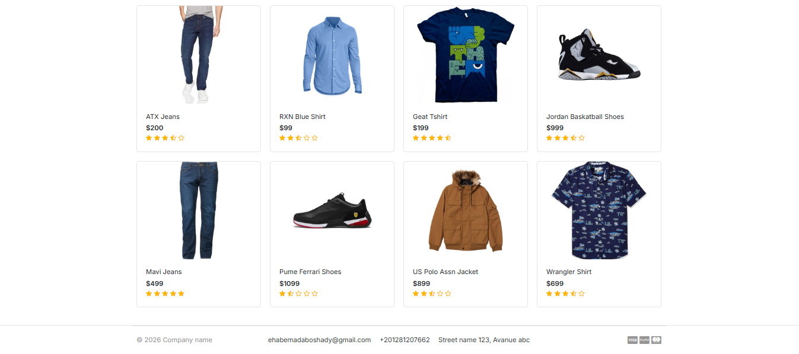
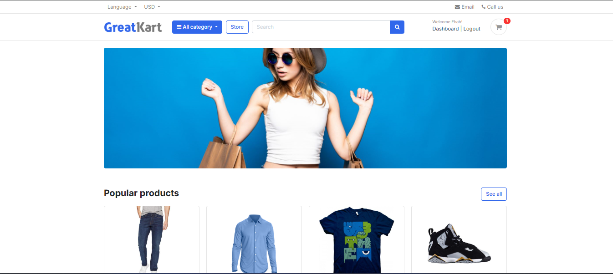
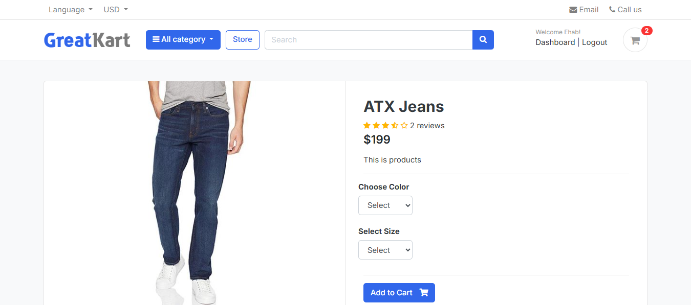
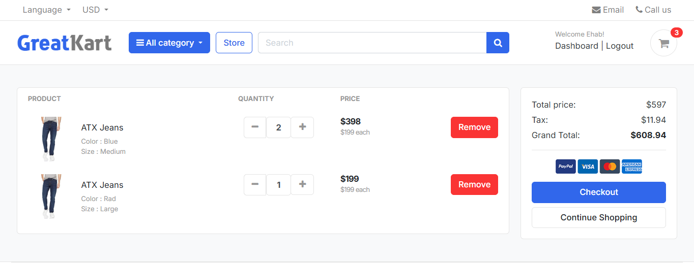
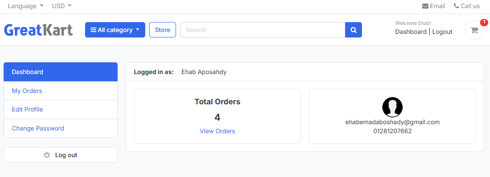
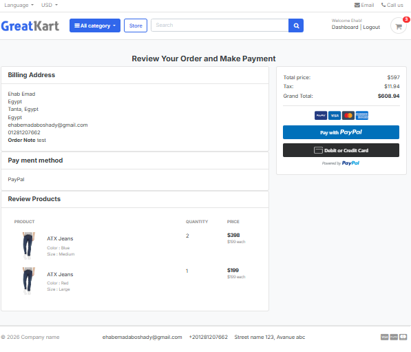

# 🛒 مشروع متجر إلكتروني باستخدام Django

هذا المشروع عبارة عن **تطبيق متجر إلكتروني (E-Commerce Web Application)** تم تطويره باستخدام إطار العمل Django.  
يتيح الموقع للمستخدمين تصفح المنتجات، البحث عنها، إضافتها إلى عربة التسوق، ثم إتمام عملية الطلب والدفع.

المشروع يحاكي متجرًا إلكترونيًا حقيقيًا ويحتوي على نظام حسابات المستخدمين، نظام المنتجات، عربة التسوق، ونظام الطلبات.

---

# 📌 مميزات المشروع

## 🛍️ المتجر (Products / Store)

- عرض جميع المنتجات المتاحة
- تصنيف المنتجات حسب الفئة (Category)
- عرض تفاصيل المنتج
- البحث عن المنتجات
- إضافة تقييمات ومراجعات للمنتجات

---

## 👤 نظام المستخدمين (Accounts)

- تسجيل حساب جديد
- تسجيل الدخول والخروج
- تفعيل الحساب عن طريق البريد الإلكتروني
- استعادة كلمة المرور
- لوحة تحكم المستخدم (Dashboard)
- تعديل الملف الشخصي
- تغيير كلمة المرور
- عرض الطلبات الخاصة بالمستخدم

---

## 🛒 عربة التسوق (Cart)

- إضافة منتج إلى العربة
- حذف منتج من العربة
- تقليل أو زيادة الكمية
- عرض المنتجات داخل العربة
- صفحة الدفع (Checkout)

---

## 📦 نظام الطلبات (Orders)

- إنشاء طلب جديد
- معالجة عملية الدفع
- صفحة إتمام الطلب
- عرض تفاصيل الطلب
- عرض جميع الطلبات الخاصة بالمستخدم

---

## 🔐 الأمان (Security)

تم استخدام مكتبة **django-admin-honeypot** لإخفاء رابط لوحة تحكم الأدمن الحقيقي  
وذلك لحماية لوحة التحكم من محاولات الاختراق أو الهجمات التلقائية.

الرابط الوهمي للأدمن:

```
/admin/
```

الرابط الحقيقي للأدمن:

```
/securelogin/
```

---

# 🏗️ هيكل المشروع

يتكون المشروع من عدة تطبيقات رئيسية:

```
Ecommerce_Project

accounts/
    نظام تسجيل المستخدمين
    تسجيل الدخول والخروج
    لوحة التحكم
    إدارة الملف الشخصي

store/
    عرض المنتجات
    عرض الفئات
    تفاصيل المنتج
    البحث
    تقييمات المنتجات

carts/
    إدارة عربة التسوق
    إضافة المنتجات
    حذف المنتجات
    تعديل الكميات

orders/
    إنشاء الطلب
    معالجة الدفع
    إتمام الطلب
```

---

# 🔗 روابط المشروع (URLS)

## الروابط الرئيسية

```
/               الصفحة الرئيسية
/store/         صفحة المتجر
/cart/          عربة التسوق
/accounts/      حسابات المستخدمين
/orders/        الطلبات
/securelogin/   لوحة تحكم الأدمن
```

---

# 📦 روابط نظام الطلبات (Orders)

```
/orders/place_order/
/orders/payments/
/orders/order_complete/
```

وظيفتها:

- إنشاء الطلب
- تنفيذ الدفع
- عرض صفحة اكتمال الطلب

---

# 🛒 روابط عربة التسوق (Cart)

```
/cart/
/cart/add_cart/<product_id>/
/cart/remove_cart/<product_id>/<cart_item_id>/
/cart/remove_cart_item/<product_id>/<cart_item_id>/
/cart/checkout/
```

وظيفتها:

- عرض العربة
- إضافة منتج
- حذف منتج
- تقليل الكمية
- الانتقال لصفحة الدفع

---

# 👤 روابط حسابات المستخدمين (Accounts)

```
/accounts/register/
/accounts/login/
/accounts/logout/
/accounts/dashboard/
/accounts/my_orders/
/accounts/edit_profile/
/accounts/change_password/
/accounts/order_detail/<order_id>/
```

وظيفتها:

- تسجيل حساب
- تسجيل الدخول
- تسجيل الخروج
- لوحة تحكم المستخدم
- عرض الطلبات
- تعديل البيانات
- تغيير كلمة المرور

---

# 🛍️ روابط المتجر (Store)

```
/store/
/store/category/<category_slug>/
/store/category/<category_slug>/<product_slug>/
/store/search/
/store/submit_review/<product_id>/
```

وظيفتها:

- عرض المنتجات
- عرض المنتجات حسب الفئة
- عرض تفاصيل المنتج
- البحث
- إضافة تقييم للمنتج

---

# ⚙️ التقنيات المستخدمة

تم بناء المشروع باستخدام التقنيات التالية:

- Python
- Django
- SQLite
- HTML
- CSS
- JavaScript
- Bootstrap

---
# 📷 صور من المشروع (Screenshots)

## الصفحة الرئيسية


## صفحة المتجر


## صفحة المنتج


## عربة التسوق


## لوحة تحكم المستخدم


## صفحة الطلبات


---
---

# ⚡ تشغيل المشروع

## 1️⃣ تحميل المشروع

```
git clone https://github.com/username/project-name.git
```

---

## 2️⃣ الدخول إلى مجلد المشروع

```
cd project-name
```

---

## 3️⃣ إنشاء بيئة افتراضية

```
python -m venv env
```

---

## 4️⃣ تفعيل البيئة

في ويندوز:

```
env\Scripts\activate
```

---

## 5️⃣ تثبيت المتطلبات

```
pip install -r requirements.txt
```

---

## 6️⃣ تنفيذ المايجريشن

```
python manage.py migrate
```

---

## 7️⃣ تشغيل السيرفر

```
python manage.py runserver
```

بعد ذلك افتح المتصفح على الرابط:

```
http://127.0.0.1:8000
```

---

# 📌 تحسينات مستقبلية

يمكن تطوير المشروع أكثر بإضافة:

- بوابة دفع حقيقية (Stripe / PayPal)
- نظام توصية بالمنتجات
- فلترة متقدمة للمنتجات
- إنشاء API للموبايل
- تحسين الأداء والسرعة

---

# 👨‍💻 المطور

**Ehab Emad**

Backend Developer  
متخصص في تطوير تطبيقات الويب باستخدام Django.
